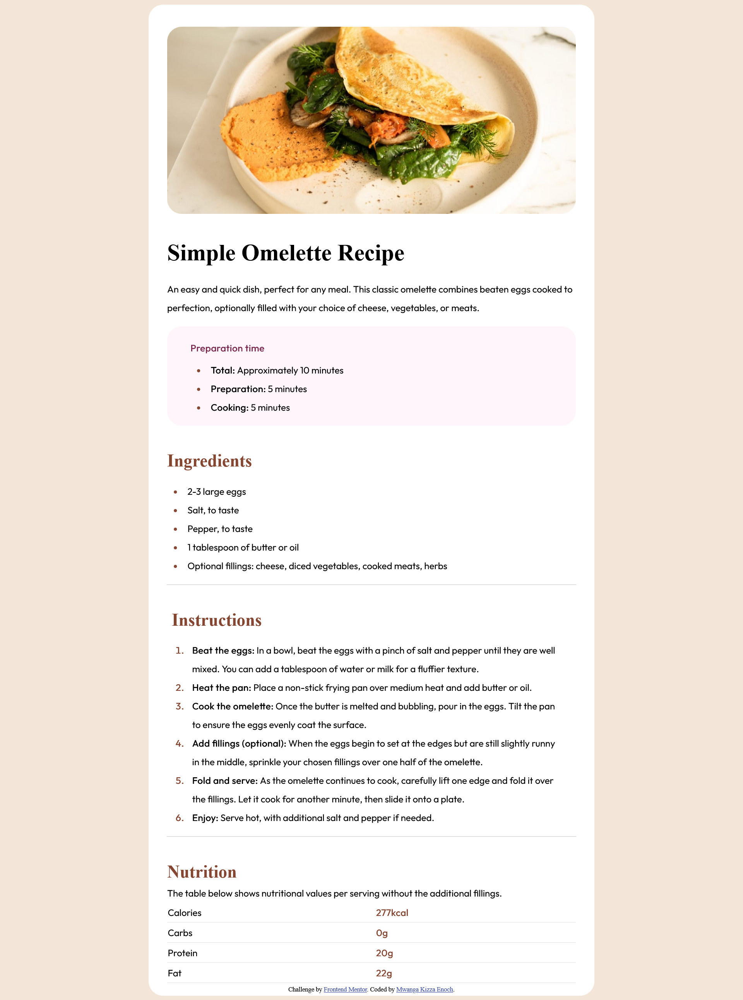

# Frontend Mentor - Recipe page solution

This is a solution to the [Recipe page challenge on Frontend Mentor](https://www.frontendmentor.io/challenges/recipe-page-KiTsR8QQKm). Frontend Mentor challenges help you improve your coding skills by building realistic projects. 

## Table of contents

- [Overview](#overview)
  - [The challenge](#the-challenge)
  - [Screenshot](#screenshot)
- [My process](#my-process)
  - [Built with](#built-with)
  - [What I learned](#what-i-learned)
  - [Continued development](#continued-development)
  - [Useful resources](#useful-resources)
- [Author](#author)

## Overview
This project was carried out to determine how well I have grasped the basics of HTML and CSS

### Screenshot

## My process
Wrote down the HTML code and then added the CSS styles in a separate styles sheet. To define proper CSS rules, some things were put into consideration for example if elements shared a certain property, grouping them into the same class was considered.

### Built with

- Semantic HTML5 markup
- CSS custom properties
- CSS Grid
- Mobile-first workflow

### What I learned

I learned specifically how to use media queries to make a web page responsive. I also learned how to utilise chrome dev tools to test how the web page responds to various media queries.

### Continued development
More focus is needed on the display CSS property.
Sequential work flow when working on projects needs to be improved.

### Useful resources

- [w3schools](https://www.w3schools.com/) - This was a good reference to information about CSS properties. I really liked the fact that they are straight-forward and that one can run the sample code on the website and actually see the results.
- [Stack Overflow](https://stackoverflow.com/) - This is a great forum to find answers for situations that may not have a direct solution for example it helped a lot when I was adding the horizontal separator between rows in the table.

## Author
- Frontend Mentor - [@enochmwanga](https://www.frontendmentor.io/profile/enochmwanga)
